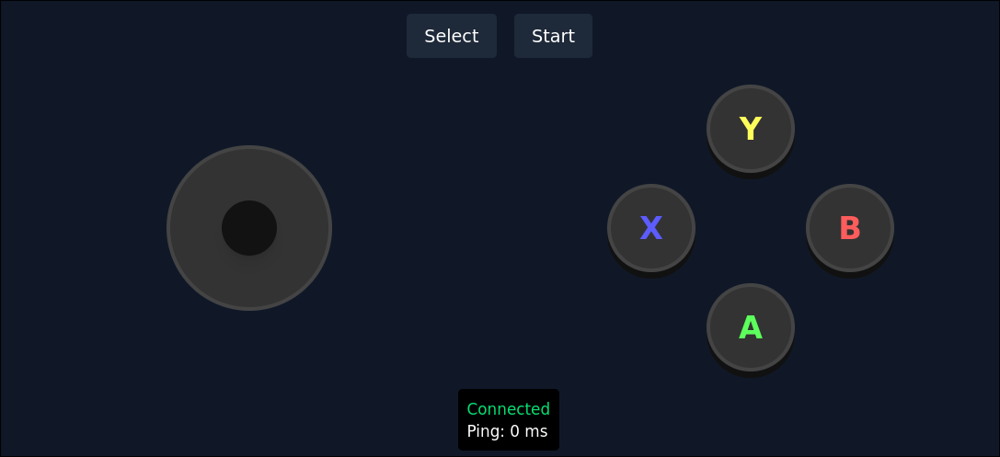

# Virtual Gamepads

Create virtual controllers for party games like Pico Park, Overcooked, or Plate
Up.

Players can use their phone's web browser to get a controller with a joystick
and basic ABXY buttons. This way, you don't need to have a ton of traditional
controllers if you want to play games on the TV with friends.

> [!NOTE]
> This app is still WIP. Functionality works, but there is room for improvement.



## Usage

This app only supports Linux at the moment, and has been tested with Steam. You
will either have to run this app as root or have access to create virtual evdev
devices (typically through a group named `input`).

Then, start/build the app:

```bash
cargo run --release
```

You will need the rust toolchain and nodejs with pnpm.

Open port :3000 on your firewall (if applicable).
Now, have all players navigate to `http://<your ip>:3000`.

## TODO

- Add support for more "complex" layouts with start and trigger buttons.
- Possibly add WebRTC support for lower latency (instead of websockets).
